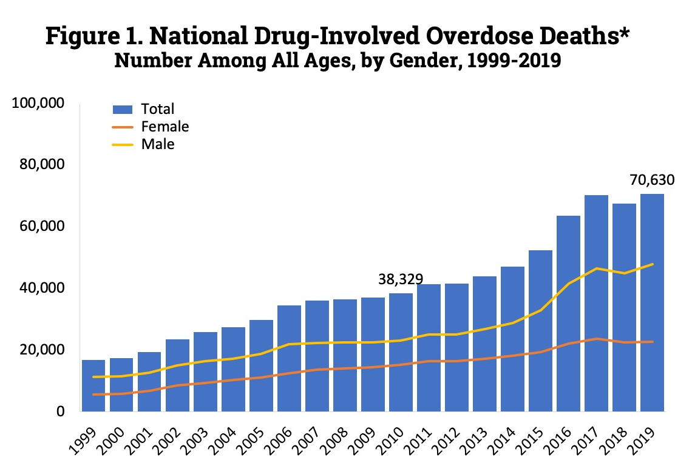
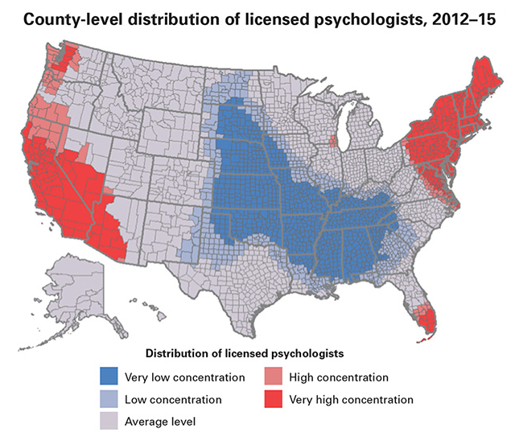
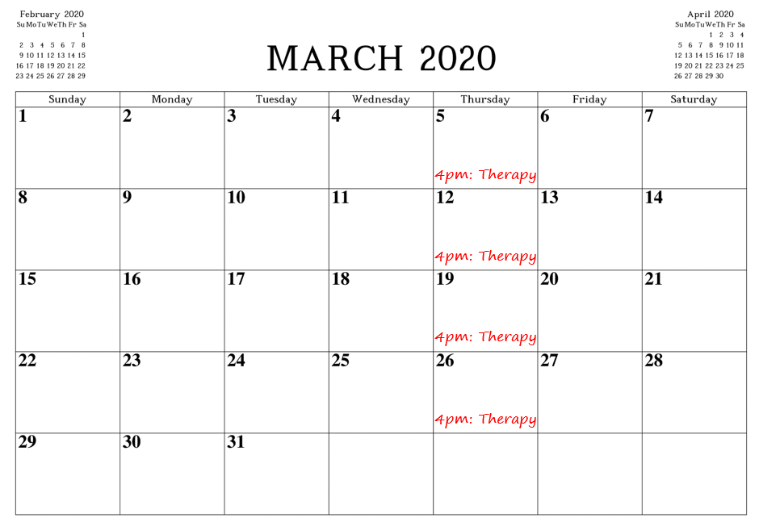
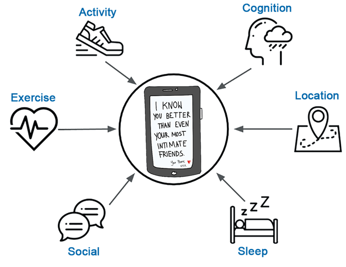

# Digital Therapeutics in Mental Healthcare: Promise, Progress, and Pitfalls

## The Current Mental Healthcare System

We have a mental healthcare crisis in the U.S. and our mental healthcare system is deeply flawed.  Our need for mental health services is alarmingly high and the practical capacity of our healthcare system to meet this need is woefully inadequate.

---

<!--consider three pie charts against total adult population of 258.3 million in 2020. -->

In 2019, the National Survey on Drug Use and Health estimated that 52 million adults suffered from some form of mental illness.  This represents almost **21%** of the U.S. adult population[^fn_nsduh]. 

19 million adults had a major depressive episode in that year. More than 20 million adults had some form of substance use disorder. 

---

In 2019 alone, the National Institute of Drug Abuse reported that more than 70,000 people had died from opioid or other drug overdoses and this number has been increasing every year for the past two decades[^fn_overdose].  

---

Suicide is the 10th leading cause of death in the U.S[^fn_death] and almost 90% of those who die by suicide have an underlying mental illness[^fn_suicide].

In 2010, the National Institute on Drug Abuse estimated the economic cost of drug abuse by itself in the United States at more than $740 billion a year and this cost was growing by more than 20 billion dollars each year due to the opioid crisis[^fn_sud_cost].

Expanding our perspective globally, in that same year mental and substance use disorders constituted 10.4% of the global burden of disease and were the leading cause of years lived with disability among all disease groups[^fn_global_burden].

We all likely know someone who is struggling with a substance use disorder or other serious, often debilitating, mental illness.  We are all touched in some way by this mental health crisis.  Unfortunately, although these numbers are tragic, they may not be that surprising to you.  

---

However, what may surprise you, and candidly I think should concern you, is that most people with mental illness in the United States do not receive treatment.  

One of out every three people with a major depressive episode in the past year did not receive any treatment in that year.

And much worse, nine out of every ten people with a substance use disorder in the past year did not receive any treatment.

Overall, well over half of individuals with any mental illness do not receive the care they need.

Furthermore, the surgeon general’s report on mental health has noted that the mental health care needs of our minority racial/ethnic groups remain largely unmet.  For example, African American & Hispanic Americans receive mental health services at about half the rate of whites[^fn_surgeongeneral].  

Similar mental healthcare disparities exist for people living in rural areas[^fn_rural].  

<!--Need a strong concluding sentence or two before the transition to why-->

---

There are at least four key issues that severely limit the capacity of our mental healthcare system.  These are:

* Access,
* Availability,
* Affordability, and 
* Acceptability

---

**Access** is one of the biggest challenges.  Consider the 52 million people diagnosed with a mental illness in any single year and compare that to the only approximately 100 thousand licensed psychologists or 500 thousand licensed therapists if you include therapists from other disciplines.  There is a clear imbalance between the need for care and the number of trained mental healthcare providers.

---

But even more importantly, these therapists are not distributed evenly across the country and their distribution does not reflect the distribution of need.  For example, if you live in the southern or middle regions of our country, your access to psychologists is very limited.  

In fact, more than 90% of all psychologists and psychiatrists, and 80% of MSWs, work exclusively in metropolitan areas[^fn_rural_2]

In contrast, 80% of rural counties do not have even a single psychiatrist; 61% lack a psychologist; and 91% lacked a psychiatric NP[^fn_rural]. 

These factors create a serious access problem.

---

For those of us who have geographic access to mental healthcare providers, **availability** poses the next issue.  Given the imbalance between the number of mental healthcare providers and the need for services, there are often long waits until care is available.  In metropolitan Madison, WI, where I live, it is simply not possible to schedule at all with many well-regarded psychologists, and others have wait lists that can delay a first visit for months.  

---

Furthermore, models for traditional individual or group psychotherapy still often revolve around weekly, monthly, or even less frequent appointments.  But, of course, our mental health needs  aren't limited this these sparse appointment schedules.  Crises, stressors, strong drug cravings, and even drug relapses can occur and require support at any time.

---

When mental healthcare is nearby and available, **affordability** emerges as a serious issue for many people.  The cost for mental health services is often prohibitive, both because of limitations in health insurance coverage for these services and for the many people from vulnerable groups that still do not have insurance.

There are also issues of **acceptability**.  Mental illness is still highly stigmatized in our society and this prevents many people from seeking necessary care.  For some, the need to talk about the most intimate and personal details of their life with someone else also poses a barrier to seeking support.

All of these issues combine to make the practical capacity of our mental health system too low to meet the high need. 

And the COVID pandemic has further highlighted the fragility of this system.  Over the last almost two years now, COVID has increased the need for services targeting substance use disorders and other mental illness.  At that the same time COVID has reduced access and availability to these services, increased problems of affordability because of the impact of job loss on health insurance[^fn_insurance], and made face-to-face mental health services less acceptable to some because of the risks of contracting COVID.     

These are serious issues.  However, to my eye, the biggest issue is that many of these issues are "baked into the cake" of how we provide mental healthcare services.  It would be very hard to meaningfully address these issues within our current system without radically changing this system.    

## Disruptive Innovation in Mental Healthcare
* ATM example of disruptive change
* Fundamental shift in how we treat and support people with mental illness
* Increase access
* Decrease disparites
* Improve outcomes

<!-- Slide: Bank teller vs. ATM.  and maybe vs. Venmo?? vs. Bitcoin??-->

However, I believe we are poised to experience disruptive innovation in the mental health services that we provide and the methods by which they are provided.

I use the term disruptive innovation intentionally to signal the magnitude and nature of this potentially transformative change.  
 
Consider how a technological innovation, Wikipedia, replaced its predecessor, Encyclopedia Britannica, and radically changed our access to reference work.  
 
Better still, consider the disruptive innovation, the ATM.  I am old enough to remember having to go to the bank on payday to have a bank teller deposit my paycheck and provide me with cash to use for my weekly purchases.  And I remember the access and availability issues associated with getting to this bank within bankers hours; And planning for weekend spending, when I wouldn't have any access to the bank and my cash at all.  Now I have 24/7 access to cash through ATMs that can be found almost everywhere.  And, of course, Venmo and similar digital payment technologies may soon provide further disruptive innovation

Digital therapeutics, and in particular, digital therapeutics delivered on smartphones and made smarter by personal sensing, is poised to radically change, and 

Will do this by targeting access, availability, affordability, and acceptablity of mental health services.

## Digital Therapeutics
* Intervention and support apps delivered on smartphones
* Available 24/7 without geographic constraints
* Highly scalable and cost efficient
* Examples of DTs
	* CBT4CBT
	* A-CHESS
	* reSET & reSET-O
* Examples of interventions, tools and services
* Preliminary evidence of efficacy

<!--Org Question: Where does smartphone come in?  As part of evolution of digital theraputics?  Need to have smartphone to increase access.  Need smartphone to be used by everyone to decrease access-->

<!-- Org Question: Where does clinician dashboard come in?  Just a service until digital theraputics meet personal sensing?-->

## Personal Sensing
* What is it
* Example from grant
* What can it do
	 * Predict
	 * Recommend treatments for people, for moment in time?
	 * Encourage adaptive changes to lifestyle
* Preliminary evidence-

---

---

<!--Slide:  My location data?-->

---

---

<!--Slide: Text message with mom vs. drug using friend.  "I'm really stressed and I am want to use....   Can you help me?"-->

## Synergies between Digital Therapeutics and Personal Sensing

<!-- Org Question: Not sure how to organize these ideas yet but this section will highlight that: 1) Digital theraputics on smartphones make personal sensing feasible, given access to sensors, software and computing power, 2) Personal sensing makes digital theraputics smarter, allowing for its supports (treatments, tools & services) to be tailored to person, place, and time, 3) Personal sensing can also encourage greater engagement with both digital theraputics and traditional mental healhcare services, and  4) Digital theraputics can provide conduit for risk and symptom sensing back to health care providers to allow for efficiet resource allocation based on momentary need.  May need to focus or curtail these ideas-->

## Obstacles and Recommendations
* How paid for?  Answer dictates other issues
	* Privacy
		* [Cambridge Analytica](https://en.wikipedia.org/wiki/Cambridge_Analytica)  
		* [Israeli Pegasus Spyware](https://en.wikipedia.org/wiki/Pegasus_(spyware))
		* Who has access to the data and who benefits?  How are commercial apps supported?
	* Evidence based vs. the wild west
	* Gamification or other techniques to encourage constant use vs. optimal  use
* Burden
	* Active vs. passive personal sensing
* Disparities reified by Artificial Intelligence Algorithms (e.g., Weapons of Math Destruction)  <!-- Slide: Book cover image?-->
* Shelf life <!-- Slide: Expired or rotting food on shelf or in frige?  ;-)-->
* Integration into clinical care.  
 	* Replace vs. supplement clinical care
	* Feedback.  
	* Encourage treatment retention.

<!-- Org Question: Won't do all of these.  Need to prioritize for interest and importance.-->

# Other Useful Sources
https://www.hopkinsmedicine.org/health/wellness-and-prevention/mental-health-disorder-statistics

https://www.nami.org/nami/media/nami-media/infographics/generalmhfacts.pdf

Geographic Variation in the Supply of Selected Behavioral Health Providers - https://www.ajpmonline.org/article/S0749-3797(18)30005-9/fulltext

Other rural cites
https://www.ruralhealthinfo.org/topics/mental-health

# Citations

[^fn_nsduh]: https://www.samhsa.gov/data/sites/default/files/reports/rpt29393/2019NSDUHFFRPDFWHTML/2019NSDUHFFR090120.htm

[^fn_overdose]: https://www.drugabuse.gov/drug-topics/trends-statistics/overdose-death-rates

[^fn_suicide]: https://www.ncbi.nlm.nih.gov/pmc/articles/PMC534107/

[^fn_death]: https://www.cdc.gov/nchs/fastats/leading-causes-of-death.htm

[^fn_surgeongeneral]: Mental Health: A Report of the Surgeon General. Rockville, Md: US Dept of Health and Human Services, Substance Abuse and Mental Health Services Administration, Center for Mental Health Services; 1999.

[^fn_rural]: https://www.ncbi.nlm.nih.gov/pmc/articles/PMC7681156/

[^fn_rural_2]: https://www.ruralhealthinfo.org/topics/mental-health

[^fn_sud_cost]:  https://archives.drugabuse.gov/trends-statistics/costs-substance-abuse

[^fn_global_burden]: Whiteford HA, Degenhardt L, Rehm J, Baxter AJ, Ferrari AJ, Erskine HE, Charlson FJ, Norman RE, Flaxman AD, Johns N et al (2013) Global burden of disease attributable to mental and substance use disorders: findings from the Global Burden of Disease Study 2010. Lancet 382: 1575–1586.

[^fn_insurance]: https://www.epi.org/publication/health-insurance-and-the-covid-19-shock/